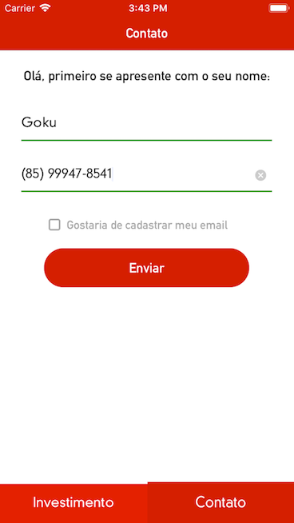

  
## Investimentos App

Aplicativo que consome dois serviços na web, preenchendo os metadados das páginas de Fundos de Investimentos e Formulário de Contato.

. | .
:-------: | :------:
 | 
    | 

  

### Como usar?

Nosso aplicativo utiliza o CocoaPods como gerenciador de pacotes, portanto, para instalar as bibliotecas utilizadas, é necessário executar o seguinte comando no diretório do projeto:

  

` pod install `

  

O comando deve gerar um arquivo chamado `Investimentos.xcworkspace` que, a partir daqui, deve ser aberto no lugar do `Investimentos.xcproject`.

  
  

### Testes

Foram criados testes unitários e de interface.

  
  

### Integração contínua

No projeto, foi utilizado o Travis CI, um servidor de Integração Contínua que possui integração com GitHub. No servidor, configuramos 3 jobs, que são executados a cada push no projeto:

* O Travis deve realizar o build do projeto.

* O Travis deve executar os testes unitários.

* O Travis deve executar o teste de interface.

